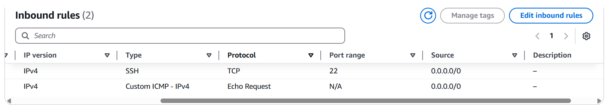
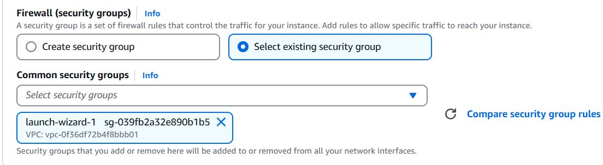

# Instalação Ansible

> Os passos abaixo foram feitos baseados no passo a passo do professor de [instalação](https://github.com/mvm-sp/iac-devops/blob/main/Appendix/Ansible/01-ubuntu-boto3.md) e [configuração dos hosts](https://github.com/mvm-sp/iac-devops/blob/main/Appendix/Ansible/04-configure-hosts.md).
É necessário ter uma conta AWS ativa.

1. No menu do EC2, crie uma Key Pair do tipo `RSA` e formato `.pem`, guardando o arquivo criado ao final

2. Crie uma EC2 (SERVIDOR PRINCIPAL), com imagem **Ubuntu**, a Key Pair criada no passo 1 e o restante das configurações como padrão

3. Edite o security group criado, adicionando uma nova regra de entrada, do tipo `Custom ICMP - IPv4`, protocolo `Echo Request` e CIDR blocks `0.0.0.0/0`. As regras devem ficar como a imagem abaixo


4. Conecte-se a EC2 criada, usando o método *EC2 Instance Connect* ou o *SSH client* (precisa da chave .pem)

5. No SERVIDOR PRINCIPAL, instale o ansible, usando os comandos abaixo
```
sudo apt update -y
sudo apt upgrade
sudo apt install -y python3 python3-pip

sudo apt install pipx -y
pipx install boto
pipx install boto3
pipx install ansible
pipx install ansible-core

# Verifique se o ansible foi instalado corretamente
ansible --version
```

6. Crie a pasta `files` e o arquivo `.pem` com o MESMO NOME da chave criada no passo 1
```
mkdir files && cd files
touch <NOME DA SUA CHAVE>.pem
```

7. Cole o conteúdo do arquivo `.pem` criado no passo 1 e salve o arquivo
```
chmod 400 <NOME DA SUA CHAVE>.pem
vim <NOME DA SUA CHAVE>.pem
```

8. Crie mais **duas** instâncias EC2 (SERVIDORES NODE), com imagem **Ubuntu**, a Key Pair criada no passo 1 e o security group já existente:


9. Conecte-se em um dos SERVIDORES NODE, usando o método *EC2 Instance Connect* ou o *SSH client* através do SERVIDOR PRINCIPAL, com a chave `.pem` que foi configurada na pasta `files`

10. No SERVIDOR PRINCIPAL, crie uma nova chave SSH e imprima e COPIE o conteúdo
```
cd ~/.ssh
ssh-keygen -t rsa -f id_rsa -q -P ""

# Copie o retorno do comando abaixo
cat id_rsa.pub
```

11. Nos SERVIDORES NODE, cadastre a chave SSH do SERVIDOR PRINCIPAL
```
vim ~/.ssh/authorized_keys
# Cole em uma nova linha o conteúdo copiado no passo 10 e salve o arquivo
```

12. No SERVIDOR PRINCIPAL, crie o arquivo `hosts` dentro da pasta `files`
```
cd ~/files
touch hosts
vim hosts
```

13. Dentro do arquivo `hosts`, coloque os IPs (públicos e privados) dos SERVIDORES NODE conforme a estrutura abaixo
```
[posmack]
34.239.118.74
18.208.115.176

[posmack_internal]
172.31.91.193
172.31.80.105
```

14. No SERVIDOR PRINCIPAL, dê um ping nos SERVIDORES NODE usando o ansible
```
ansible -i hosts posmack -m ping

# Será necessário enviar dois comandos 'yes' para permitir a conexão inicial entre os servidores
yes
yes
```

15. Execute o update e o upgrade nos SERVIDORES NODE
```
ansible -i hosts -m shell -a 'apt update -y' posmack --become
ansible -i hosts -m shell -a 'apt upgrade' posmack --become
```