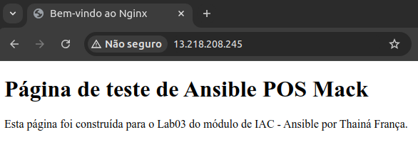

# Criação de servidor com NGINX

1. Crie uma EC2 (SERVIDOR WEB), com imagem **Ubuntu**, a Key Pair criada na aula anterior e o security group já existente

2. Edite o security group, adicionando uma nova regra de entrada, do tipo `HTTP` e CIDR blocks `0.0.0.0/0`

3. Conecte-se ao SERVIDOR PRINCIPAL e copie a chave SSH criada na aula anterior
```
# Copie o retorno do comando abaixo
cat ~/.ssh/id_rsa.pub
```

4. Conecte-se ao SERVIDOR WEB e cadastre a chave SSH do SERVIDOR PRINCIPAL
```
vim ~/.ssh/authorized_keys
# Cole em uma nova linha o conteúdo copiado no passo 3 e salve o arquivo
```

5. No SERVIDOR PRINCIPAL, dentro do arquivo `~/files/hosts`, adicione o IP público do SERVIDOR WEB conforme a estrutura abaixo
```
[posmack_web]
13.218.208.245
```

6. No SERVIDOR PRINCIPAL, use o ansible para instalar o NGINX no SERVIDOR WEB
```
ansible posmack_web -i hosts -m shell -a 'apt install nginx -y' --become
ansible posmack_web -i hosts -m shell -a 'service nginx status' --become
```

7. No SERVIDOR WEB, modifique o conteúdo da página padrão do NGINX
```
cd /var/www/html
sudo vim index.nginx-debian.html
```
Substitua todo o conteúdo do arquivo por este:
```
<!DOCTYPE html>
<html lang="pt-br">
<head>
    <meta charset="UTF-8">
    <meta name="viewport" content="width=device-width, initial-scale=1.0">
    <title>Bem-vindo ao Nginx</title>
</head>
<body>
    <h1>Página de teste de Ansible POS Mack</h1>
    <p>Esta página foi construída para o Lab03 do módulo de IAC - Ansible.</p>
</body>
</html>
```

8. Para visualizar a página inicial do SERVIDOR WEB, acesse o IP público dele através de um navegador


<br/>
<br/>

# Criação de um playbook

1. Instale a collection da AWS no Ansible e verifique a versão
```
ansible-galaxy collection install amazon.aws
ansible-galaxy collection list | grep -i aws
```

2. Configure a dependência boto
```
ansible -m setup localhost | grep python

# Copie o caminho que apareceu na resposta acima para executar os comandos abaixo

<caminho_do_ansible> -m pip install boto3 botocore
<caminho_do_ansible> -m pip list | grep boto
```

3. Crie um playbook para subir uma instância EC2, ajustando os valores de `key_name`, `region`, `image_id` e `vpc_subnet_id`
```
vim create_ec2.yml
# Cole o conteúdo do arquivo que está na pasta playbook desse repositório e salve o arquivo
```

4. Execute o playbook criado
```
ansible-playbook create_ec2.yml -i hosts
```

5. Conecte-se ao SERVIDOR PRINCIPAL e cadastre o IP da EC2 criada no arquivo `hosts` com a estrutura abaixo
```
[ansible_srv]
98.81.104.57
```

6. No SERVIDOR PRINCIPAL, copie a chave SSH criada na aula anterior
```
# Copie o retorno do comando abaixo
cat ~/.ssh/id_rsa.pub
```

7. Conecte-se na EC2 criada e cadastre a chave SSH do SERVIDOR PRINCIPAL
```
vim ~/.ssh/authorized_keys
# Cole em uma nova linha o conteúdo copiado no passo 6 e salve o arquivo
```

8. No SERVIDOR PRINCIPAL, dê um ping nos SERVIDORES criados usando o ansible
```
ansible -i hosts ansible_srv -m ping
```