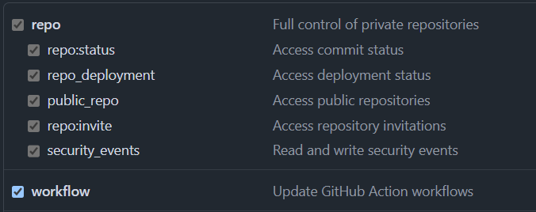

# Criação de pipelines

> Os passos abaixo foram feitos baseados no passo a passo do professor de [instalação do Molecule](https://github.com/mvm-sp/iac-devops/blob/main/05%20-%20Pipelines/labs/01-lab.md) e [CI/CD com GitHub Actions](https://github.com/mvm-sp/iac-devops/blob/main/05%20-%20Pipelines/labs/02-lab.md).

1. Conecte-se no SERVIDOR PRINCIPAL e instale o Ansible Molecule e alguns recursos
```
pipx install molecule[docker] docker
pipx install yamllint ansible-lint

sudo apt install tree
```

2. Valide a instalação e verifique a versão instalada
```
molecule --version
```

3. Crie uma pasta para criação da pipeline
```
mkdir ~/files/lab06 && cd ~/files/lab06
```

4. Crie um playbook para criar um security group, ajustando os valores de `vpc_id` e `region`
```
vim security-group.yml
# Cole o conteúdo do arquivo que está na pasta playbooks desse repositório e salve o arquivo
```

5. Inicialize o Ansible Molecule
```
molecule init scenario
```

6. Verifique os arquivos criados pelo comando molecule
```
tree

# A estrutura retornada será similar a essa:
#.
#├── molecule
#│   └── default
#│       ├── converge.yml
#│       ├── create.yml
#│       ├── destroy.yml
#│       └── molecule.yml
#└── security-group.yml
```

7. Altere o arquivo `converge.yml`, incluindo a task a ser executada
```
cd molecule/default/
vim converge.yml
```

Cole o conteúdo abaixo no seu arquivo:
```
- name: Converge
  hosts: all
  gather_facts: false
  tasks:
    - ansible.builtin.debug:
        msg: "Fake ansible.builtin.import_playbook : ../../security-group.yml"

- name: Include a play after another play
  ansible.builtin.import_playbook: ../../security-group.yml
```

8. Realize o teste do Ansible Module
```
cd ~/files/lab06
molecule test
```

Através do log é possível observar que o molecule executou os arquivos `destroy.yml`, `create.yml` e `converge.yml` em ordem, como uma pipeline.

9. Agora vamos integrar com o Github Actions, crie um novo repositório no Github e faça o clone no SERVIDOR PRINCIPAL
```
mkdir ~/github && cd ~/github
git clone <URL do seu repositório git>

# Entre na pasta criada pelo comando acima
```

10. Copie o conteúdo da pasta lab06 para a pasta do repositório Github
```
cp -r ~/files/lab06/. ./.
tree

# A estrutura retornada será similar a essa:
#.
#├── README.md
#├── molecule
#│   └── default
#│       ├── converge.yml
#│       ├── create.yml
#│       ├── destroy.yml
#│       └── molecule.yml
#└── security-group.yml
```

11. Altere o arquivo `converge.yml`, comentando as duas últimas linhas
```
cd molecule/default/
vim converge.yml
```

12. Crie uma pasta para criar o workflow de Github Actions
```
mkdir .github
mkdir .github/workflows && cd .github/workflows
```

13. Crie um arquivo `ci.yml` com o seguinte conteúdo:
```
name: Molecule CI
on:
  push:
    branches:
      - 'main'

jobs:
  molecule:
    runs-on: ubuntu-latest
    strategy:
      fail-fast: false
      matrix:
        scenario: [default,blue-green]      
        os: [centos-8, debian-10, fedora-34, oraclelinux-8, ubuntu-20.04]
    steps:
      - name: Checkout
        uses: actions/checkout@v4
        with:
          path: "${{ github.repository }}"

      - name: Set up Python 3.
        uses: actions/setup-python@v5
        with:
          python-version: '3.x'

      - name: Install Ansible.
        run: pip3 install ansible          

      - name: Install molecule[docker].
        run: pip3 install molecule[docker]

      - name: Install yamllint.
        run: pip3 install yamllint

      - name: Install ansible-lint.
        run: pip3 install ansible-lint    
 
      - name: Molecule
        uses: gofrolist/molecule-action@v2
        with:
          molecule_options: --debug --base-config ../../tests/molecule/base.yml
          molecule_command: test
          molecule_working_dir: ${{ github.repository }}
        env:
          PY_COLORS: '1'
          ANSIBLE_FORCE_COLOR: '1'
      - name: Run Molecule tests.
        run: molecule -verbose test
        env:
          PY_COLORS: '1'
          ANSIBLE_FORCE_COLOR: '1'
          MOLECULE_DISTRO: ${{ matrix.distro }}
        working-directory: "${{ github.repository }}"          
concurrency:
  group: ${{ github.workflow }}
  cancel-in-progress: true
```

14. No Github, crie um [access token classic](https://github.com/settings/tokens/new), habilite as permissões conforme a imagem abaixo e copie o token gerado


15. Faça o commit da alteração e o push
```
git add .
git commit -m 'Configurando o Ansible Molecule'

# Após o comando abaixo, será preciso informar o seu usuário do Github e, no lugar da senha, informe o token gerado no passo anterior
git push
```

16. Na aba Actions do repositório Github, acompanhe a execução do workflow criado, que será executado em 10 cenários diferentes
